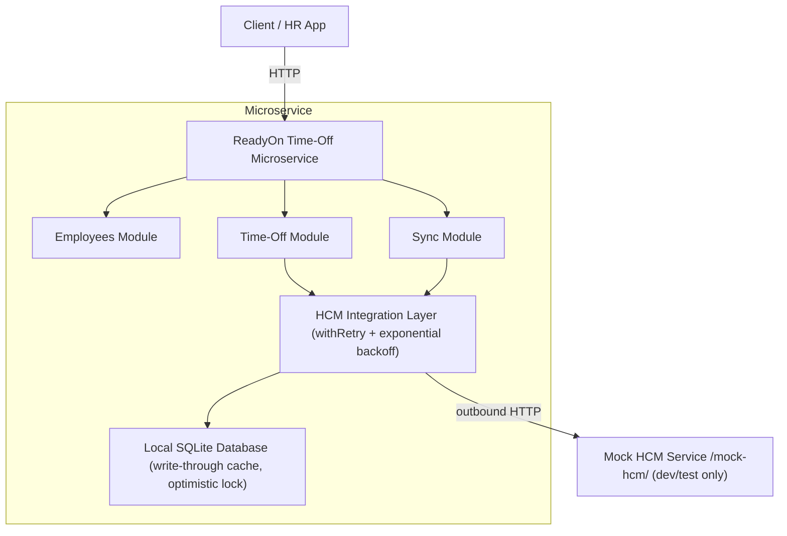

# ReadyOn Time-Off Microservice

A production-grade **Time-Off Microservice** for the ExampleHR (ReadyOn) platform, built with **NestJS**, **TypeORM**, and **SQLite**. It integrates with an external HR system called **HCM** (the source of truth for employee leave balances) while maintaining a local write-through cache for resilience.

---

## Table of Contents

1. [Architecture Overview](#architecture-overview)
2. [Key Design Decisions](#key-design-decisions)
3. [Prerequisites](#prerequisites)
4. [Setup](#setup)
5. [Running the Service](#running-the-service)
6. [Seeding the Database](#seeding-the-database)
7. [Running Tests](#running-tests)
8. [API Reference](#api-reference)
9. [Consistency Strategy](#consistency-strategy)
10. [Project Structure](#project-structure)

---

## Architecture Overview



---

## Key Design Decisions

| Decision | Choice | Rationale |
|---|---|---|
| **Consistency at approval** | Mandatory live HCM fetch | Prevents approving when HCM balance is insufficient |
| **Consistency at creation** | Cache with staleness fallback (1 hr) | Resilience when HCM is temporarily unavailable |
| **Concurrency** | Optimistic locking (`@VersionColumn`) + 3-retry loop | SQLite does not support row-level pessimistic locks |
| **HCM failures** | Exponential backoff retry (3 attempts) | Transient failures are common in distributed systems |
| **Post-approval sync** | Best-effort + `FAILED` status for retry queue | Approval must not fail due to HCM sync issues |
| **Balances as cache** | Local SQLite stores HCM balances | Single source of truth remains HCM; cache provides resilience |
| **Scheduler** | `@nestjs/schedule` cron every 15 min | Keeps cache fresh without constant HCM polling |

Full technical rationale in [docs/TRD.md](docs/TRD.md).
System design and flow diagrams in [docs/SYSTEM_DESIGN.md](docs/SYSTEM_DESIGN.md).

---

## Prerequisites

- **Node.js** >= 18
- **npm** >= 9
- No external databases required - SQLite is bundled via `better-sqlite3`

---

## Setup

```bash
# 1. Clone the repository
git clone https://github.com/kaifabbas110/ExampleHR.git
cd ExampleHR

# 2. Install dependencies
npm install

# 3. Configure environment
cp .env.example .env
# Edit .env if needed - defaults work out of the box
```

### Environment Variables

| Variable | Default | Description |
|---|---|---|
| `PORT` | `3000` | HTTP listen port |
| `DB_PATH` | `./data/readyon.db` | SQLite database path |
| `HCM_BASE_URL` | `http://localhost:3000/mock-hcm` | HCM API base URL |
| `HCM_API_KEY` | `dev-key-change-me` | API key for HCM auth |
| `HCM_TIMEOUT_MS` | `5000` | Per-request timeout |
| `HCM_MAX_RETRIES` | `3` | Max retry attempts |
| `HCM_RETRY_BASE_DELAY_MS` | `500` | Backoff base delay |
| `SYNC_CRON_SCHEDULE` | `*/15 * * * *` | Cron schedule |
| `BALANCE_STALE_THRESHOLD_MS` | `900000` | 15-min stale warning |
| `BALANCE_MAX_ACCEPTABLE_STALE_MS` | `3600000` | 1-hr max acceptable stale |
| `MOCK_HCM_FAILURE_RATE` | `0.2` | Simulated failure rate (0-1) |

---

## Running the Service

```bash
# Development mode (with hot reload)
npm run start:dev

# Production mode
npm run build
npm run start:prod
```

The service starts at `http://localhost:3000`.
The mock HCM is served at `http://localhost:3000/mock-hcm`.

---

## Seeding the Database

Creates 5 employees matching the mock HCM seed data (HCM-EMP-001 through HCM-EMP-005):

```bash
npm run seed
```

---

## Running Tests

```bash
# All tests
npm test

# Unit tests only
npm run test:unit

# Integration tests only
npm run test:integration

# E2E tests
npm run test:e2e

# Test coverage report
npm run test:cov
```

### Test Results

| Suite | Tests | Description |
|---|---|---|
| `test/unit/time-off.service.spec.ts` | 48 | Core business logic |
| `test/unit/sync.service.spec.ts` | 10 | Sync orchestration |
| `test/unit/hcm-integration.service.spec.ts` | 6 | HCM client & retry logic |
| `test/integration/time-off.integration.spec.ts` | 20 | Full flow with in-memory SQLite |
| `test/e2e/app.e2e.spec.ts` | - | HTTP-level with supertest |
| **Total** | **85** | **All passing** |

### Coverage Summary

| Metric | Overall |
|---|---|
| Statements | 89.41% |
| Branches | 58.37% |
| Functions | 89.09% |
| Lines | 89.05% |

### Edge Cases Covered

- Insufficient balance (creation and approval)
- HCM down - cache fallback (fresh vs. stale vs. missing)
- Mandatory live HCM fetch on approval
- Overlapping leave dates
- Idempotency key deduplication
- Concurrent approval race condition
- Out-of-sync balances (HCM lower than cache)
- Post-approval HCM submission failure (marked for retry)
- Max retry exhaustion
- Input validation (whitelist, type coercion, custom validators)
- Correlation ID propagation

---

## API Reference

### Employees

| Method | Path | Description |
|---|---|---|
| `POST` | `/employees` | Create a new employee |
| `GET` | `/employees` | List all active employees |
| `GET` | `/employees/:id` | Get employee by ID |
| `DELETE` | `/employees/:id` | Deactivate employee |

**Create Employee** - `POST /employees`

```json
{
  "employeeCode": "EMP-001",
  "name": "Alice Johnson",
  "email": "alice@example.com",
  "department": "Engineering",
  "hcmEmployeeId": "HCM-EMP-001",
  "locationId": "LOC-001"
}
```

---

### Time-Off

| Method | Path | Description |
|---|---|---|
| `POST` | `/time-off/request` | Submit a leave request |
| `GET` | `/time-off/balance?employeeId=` | Get current leave balances |
| `GET` | `/time-off/history?employeeId=` | Get leave history (paginated) |
| `PUT` | `/time-off/approve/:id` | Approve or reject a request |

**Submit Leave Request** - `POST /time-off/request`

```json
{
  "employeeId": "<uuid>",
  "leaveType": "ANNUAL",
  "startDate": "2026-07-01",
  "endDate": "2026-07-05",
  "reason": "Summer vacation",
  "idempotencyKey": "optional-unique-key"
}
```

Leave types: `ANNUAL`, `SICK`, `EMERGENCY`, `MATERNITY`, `PATERNITY`, `UNPAID`

**Approve/Reject** - `PUT /time-off/approve/:id`

```json
{
  "action": "APPROVE",
  "approverId": "manager-id"
}
```

```json
{
  "action": "REJECT",
  "approverId": "manager-id",
  "rejectedReason": "Team understaffed during that period"
}
```

**Get Balance** - `GET /time-off/balance?employeeId=<uuid>`

```json
{
  "employeeId": "<uuid>",
  "source": "HCM",
  "isStale": false,
  "asOf": "2026-01-15T10:00:00.000Z",
  "balances": [
    {
      "leaveType": "ANNUAL",
      "totalDays": 21,
      "usedDays": 5,
      "pendingDays": 2,
      "availableDays": 14
    }
  ]
}
```

---

### Sync

| Method | Path | Description |
|---|---|---|
| `POST` | `/sync/hcm` | Trigger manual HCM sync |
| `GET` | `/sync/logs?limit=` | Get recent sync logs |

---

### Mock HCM (Dev/Test Only)

| Method | Path | Description |
|---|---|---|
| `GET` | `/mock-hcm/balance/:hcmEmployeeId` | Get employee balance |
| `POST` | `/mock-hcm/leave/submit` | Submit a leave request |
| `GET` | `/mock-hcm/sync/batch` | Batch balance sync |
| `POST` | `/mock-hcm/admin/reset` | Reset mock state |

---

## Consistency Strategy

### Normal Path

1. Leave creation: attempt live HCM fetch - on success, update local cache - check balance
2. If HCM unavailable: fall back to cache if age < 1 hour; otherwise reject with `503`
3. On approval: **always** fetch live from HCM (no fallback) to guarantee fresh balance check
4. Post-approval: submit to HCM asynchronously; failures queued for retry

### Retry Logic

- Max 3 attempts with exponential backoff: `min(500 x 2^(n-1), 5000)ms`
- Non-retryable on 4xx (except 429)
- Post-approval HCM submissions retried up to 5 times during scheduled sync

### Background Sync

- Cron scheduler runs every 15 minutes
- Attempts batch endpoint first, falls back to individual fetches per employee
- Retries all `hcmSyncStatus=FAILED` approved requests

Full details in [docs/TRD.md](docs/TRD.md).

---

## Project Structure

```
src/
+-- app.module.ts
+-- main.ts
+-- seed.ts
+-- config/
¦   +-- configuration.ts
+-- common/
¦   +-- constants/leave-types.constant.ts
¦   +-- filters/all-exceptions.filter.ts
¦   +-- interceptors/logging.interceptor.ts
¦   +-- utils/retry.util.ts
+-- entities/
¦   +-- employee.entity.ts
¦   +-- leave-balance.entity.ts
¦   +-- leave-request.entity.ts
¦   +-- sync-log.entity.ts
+-- hcm/
¦   +-- dto/hcm.dto.ts
¦   +-- hcm-integration.service.ts
¦   +-- hcm-mock.service.ts
¦   +-- hcm-mock.controller.ts
¦   +-- hcm.module.ts
+-- employees/
¦   +-- dto/create-employee.dto.ts
¦   +-- employees.service.ts
¦   +-- employees.controller.ts
¦   +-- employees.module.ts
+-- time-off/
¦   +-- dto/
¦   ¦   +-- create-time-off-request.dto.ts
¦   ¦   +-- approve-time-off.dto.ts
¦   +-- time-off.service.ts
¦   +-- time-off.controller.ts
¦   +-- time-off.module.ts
+-- sync/
    +-- sync.service.ts
    +-- sync.scheduler.ts
    +-- sync.controller.ts
    +-- sync.module.ts

test/
+-- unit/
+-- integration/
+-- e2e/

docs/
+-- TRD.md
+-- SYSTEM_DESIGN.md
+-- COVERAGE_REPORT.md
+-- INTERVIEW_NOTES.md
```
